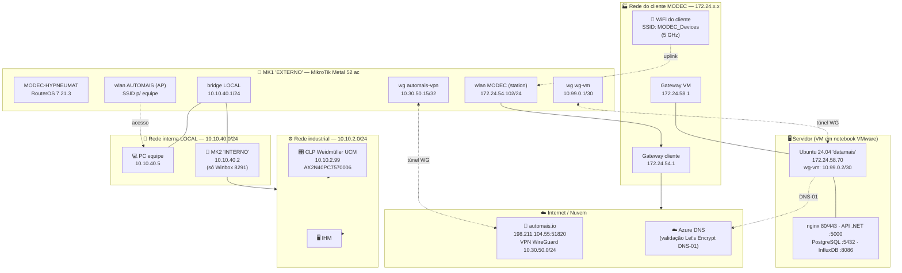
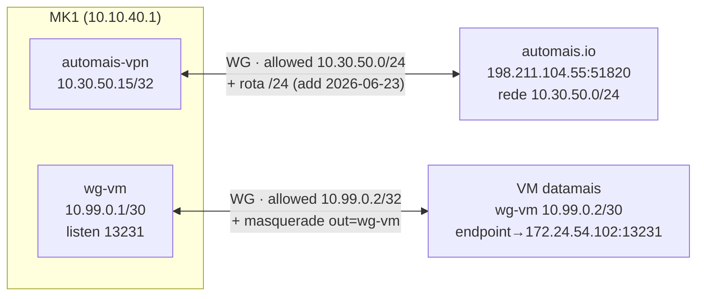
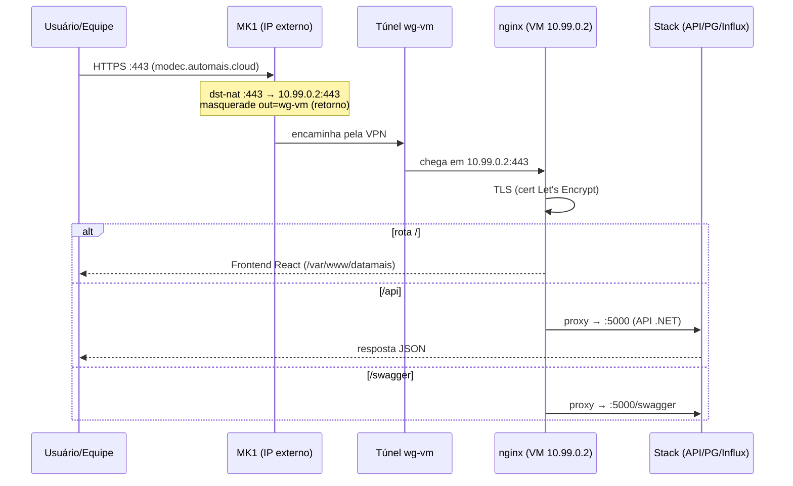
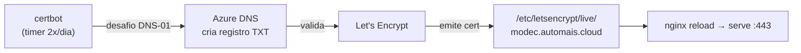
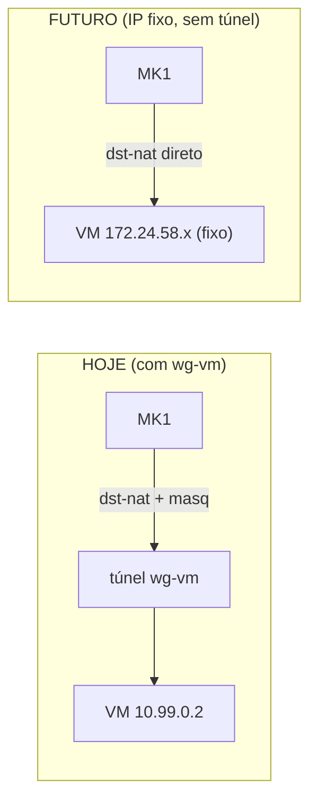

# 🌐 Topologia de Infraestrutura — Site MODEC / Plataforma DataMais

> Documento de referência da rede, equipamentos, túneis e fluxos da instalação no cliente **MODEC**.
> Levantado e validado em **2026-06-23**. Os diagramas usam Mermaid (renderizam no GitHub/VS Code).

---

## 1. Visão geral (mapa físico/lógico)

**Leitura rápida:** o **MK1** é o ponto de presença — conecta no WiFi do cliente (uplink) e sobe os túneis. A **VM servidora** fica atrás dele (num notebook) e é publicada via túnel `wg-vm`. A **rede industrial** (CLP + IHM) fica atrás do **MK2 interno**.

---

## 2. Equipamentos

| Papel | Equipamento | Modelo / SO | Gerência | Observações |
|---|---|---|---|---|
| **MK1 "externo"** | MikroTik | Metal 52 ac (`RBMetalG-52SHPacn`) · RouterOS **7.21.3** | `10.10.40.1` (SSH) | Serial `HJC0A9DACE9`. RouterBOOT 6.49.17 (**upgrade pendente**). 24 MiB livres de 64. |
| **MK2 "interno"** | MikroTik | (a confirmar) | `10.10.40.2` (**só Winbox 8291**) | Roteia a rede industrial. SSH/API desativados. |
| **Servidor** | VM Ubuntu 24.04 "datamais" | VMware Workstation **em notebook** | `172.24.58.70` (SSH) | open-vm-tools ativo. **Desliga junto com o notebook.** |
| **CLP** | Weidmüller UCM | `AX2N40PC7570006` | `10.10.2.99` | Web `https://10.10.2.99` (cert autoassinado). Modbus 502. |
| **IHM** | — | — | rede `10.10.2.0/24` | Conecta no MK2 interno. |
| **PC equipe** | Windows | — | `10.10.40.5` (gw `10.10.40.1`) | Acesso via plink/PuTTY aos MKs e VM. |

---

## 3. Endereçamento e redes

| Rede | Faixa | Onde |
|---|---|---|
| WiFi cliente (uplink MK1) | `172.24.54.0/24` (gw `.1`) | MK1 station → IP `172.24.54.102` |
| Rede da VM | `172.24.58.0/24` (gw `.1`) | VM `172.24.58.70` |
| LOCAL (gerência) | `10.10.40.0/24` | MK1 `.1`, PC `.5`, MK2 `.2` |
| Industrial (CLP/IHM) | `10.10.2.0/24` | CLP `.99`, via MK2 |
| VPN Automais | `10.30.50.0/24` | MK1 `.15`, servidor `.1` (automais.io) |
| Túnel VM↔MK | `10.99.0.0/30` | MK1 `.1`, VM `.2` |

---

## 4. Túneis WireGuard

### 4.1 `automais-vpn` (MK1 ↔ nuvem)
- **Função:** acesso remoto da equipe / presença na nuvem Automais.
- Peer: `automais.io:51820` (198.211.104.55), `allowed-address = 10.30.50.0/24`. Túnel **saudável** (handshake ativo).
- ⚠️ **Correção feita hoje:** faltava a **rota `10.30.50.0/24 → automais-vpn`** (só existia a `/32` do próprio MK). Sem ela, `ping 10.30.50.1` saía pela default e falhava. No RouterOS 7, `allowed-address` **não cria rota** — tem que adicionar manualmente.

### 4.2 `wg-vm` (MK1 ↔ VM)
- **Função:** publicar os serviços da VM através do MK (caminho de entrada do site).
- VM pubkey `flaCIt2o…RDf1o=` · MK pubkey `OlX4cuGh…8lU=` · endpoint da VM `172.24.54.102:13231`.
- ⚠️ **Restaurado hoje** após a interface ter sido apagada no MK. Exigiu: **gerar par novo no MK** (a chave antiga se perdeu), **trocar a pubkey do peer na VM**, **corrigir o endpoint** (`.30`→`.102`) e **recriar o masquerade** `out-interface=wg-vm` (que sumiu junto com a interface).

---

## 5. Fluxo de entrada do serviço (como `modec.automais.cloud` é servido)

### Mapa de portas encaminhadas pelo MK1 → VM (`10.99.0.2`)
| Porta no MK | → VM | Serviço |
|---|---|---|
| 80, 443 | 80, 443 | nginx (web/HTTPS) |
| 5000 | 5000 | API .NET (direta) |
| 5432 | 5432 | PostgreSQL |
| 8086 | 8086 | InfluxDB |
| 3222 | 22 | SSH da VM |

> nginx (site `modec`): `/` → frontend React · `/api` → `:5000` · `/swagger` → `:5000/swagger`.

---

## 6. Certificado TLS (Let's Encrypt)

- Domínio `modec.automais.cloud` · validação **DNS-01 via Azure** (`authenticator = dns-azure`, creds em `/etc/letsencrypt/azure/credentials.ini`).
- **Não depende** de porta 80/443 abertas nem do túnel — só da VM ligada + creds Azure.
- **Renovado em 2026-06-23 → válido até 2026-09-21.**
- ⚠️ **Causa de ter vencido (27/05):** a VM (notebook) ficou desligada na janela de renovação. Risco recorrente enquanto o servidor for um notebook que desliga.

---

## 7. Caminhos de acesso (cheat-sheet)

| Quero acessar | Como |
|---|---|
| **MK1 externo** | `ssh becape@10.10.40.1` (RouterOS) |
| **MK2 interno** | **Winbox** em `10.10.40.2:8291` (SSH desativado) |
| **VM servidor (CLI)** | `ssh becape@172.24.58.70` (direto, interno) ou `:3222` via MK |
| **Site DataMais** | `https://modec.automais.cloud` |
| **API / Swagger** | `…/api` · `…/swagger` |
| **CLP Weidmüller** | `https://10.10.2.99` (Web), Modbus TCP `:502` |
| **PC equipe → CLP** | já roteado: PC → MK1 → MK2 → `10.10.2.99` |

---

## 8. ⚠️ Pendências e pontos de atenção

| # | Item | Severidade | Ação sugerida |
|---|---|---|---|
| 1 | **Servidor é VM em notebook** — desliga e derruba serviço + cert | 🔴 Alta | Mover p/ host sempre-ligado **ou** IP fixo (ver §9) |
| 2 | **VM não acessa `10.30.50.1`** | 🟡 Média | **Investigar amanhã**: falta rota na VM p/ `10.30.50.0/24` via `10.99.0.1` **e** masquerade no MK do `wg-vm`→`automais-vpn` |
| 3 | **DNS `modec.automais.cloud` resolveu p/ `172.24.58.68`** (≠ VM `.70`) | 🟡 Média | Conferir a entrada DNS / split-horizon — pode confundir acesso |
| 4 | **Rekey do MK** — pubkey mudou (`0X36…`→`OlX4…`) | 🟢 Baixa | Atualizar qualquer outro peer que apontasse p/ a chave antiga |
| 5 | **RouterBOOT do MK1** 6.49.17 vs RouterOS 7.21.3 | 🟢 Baixa | `/system routerboard upgrade` + reboot |
| 6 | **MK2 só com Winbox** | 🟢 Baixa | Habilitar SSH p/ gerência por CLI |
| 7 | **Endpoint do túnel = `172.24.54.102`** (IP do MK no cliente) | 🟡 Média | Se for DHCP, **pedir reserva/fixo** p/ não quebrar o túnel |

---

## 9. 💡 Em estudo: IP fixo para a VM (substituir a VPN local `wg-vm`?)

**Ideia:** pedir à infra local do cliente um **IP fixo** para a VM, e reconsiderar a necessidade do túnel `wg-vm` entre VM e MK1.

### Análise

**✅ A favor de remover o túnel (com IP fixo):**
- Menos peças móveis — o `wg-vm` já quebrou uma vez (chave + masquerade + endpoint). Some essa classe de falha.
- O MK poderia fazer `dst-nat` direto para o IP fixo da VM na rede do cliente.
- Um problema a menos para diagnosticar.

**⚠️ Contra / cuidados:**
- **Caminho de retorno:** hoje o `masquerade` no `wg-vm` garante a volta. Sem túnel, a VM precisa que a rota de volta ao cliente que origina o acesso funcione (gateway `172.24.58.1`). Se o acesso externo vier pela nuvem (`automais.io`), a VM precisa de **rota** para `10.30.50.0/24` apontando ao MK — senão cai na default.
- **Segurança:** o túnel isola a VM numa rede ponto-a-ponto. Expor a VM direto na rede do cliente aumenta a superfície (Postgres `:5432`, Influx `:8086` hoje escutam em `0.0.0.0`). Se for por IP fixo, **fechar essas portas** (bind em 127.0.0.1 ou firewall).
- **Dependência do cliente:** o IP fixo passa a depender da infra deles não mudar. Reserva DHCP por MAC é o ideal.
- **O túnel não era para o certificado** — então removê-lo **não afeta** a emissão TLS (DNS-01/Azure). Mas **afeta servir o site** se o `dst-nat` não for refeito para o novo IP.

### Recomendação preliminar
Manter o `wg-vm` **até** o IP fixo estar entregue e validado. Então: refazer o `dst-nat` do MK para o IP fixo, ajustar rotas/firewall, testar ponta-a-ponta, e só depois aposentar o túnel. **Não remover antes** — sob risco de derrubar o serviço de novo.

> ❓ A decisão de fato (manter vs. migrar) fica para quando o IP fixo for entregue pela infra local. Esta seção é só o estudo prévio.

---

## 10. Histórico de mudanças (2026-06-23)

- ✅ Túnel `wg-vm` **restaurado** (rekey no MK, pubkey atualizada na VM, endpoint `.30`→`.102`).
- ✅ **Masquerade** `out-interface=wg-vm` recriado no MK → serviço voltou a abrir.
- ✅ Certificado Let's Encrypt **renovado** (válido até 2026-09-21) + nginx recarregado.
- ✅ **Rota `10.30.50.0/24 → automais-vpn`** adicionada no MK → `ping 10.30.50.1` OK (~110 ms).
- 🔜 **Amanhã:** investigar VM → `10.30.50.1`; conferir DNS `.68`; avaliar IP fixo.

---

*Documento gerado a partir do levantamento ao vivo dos equipamentos em 2026-06-23.*
